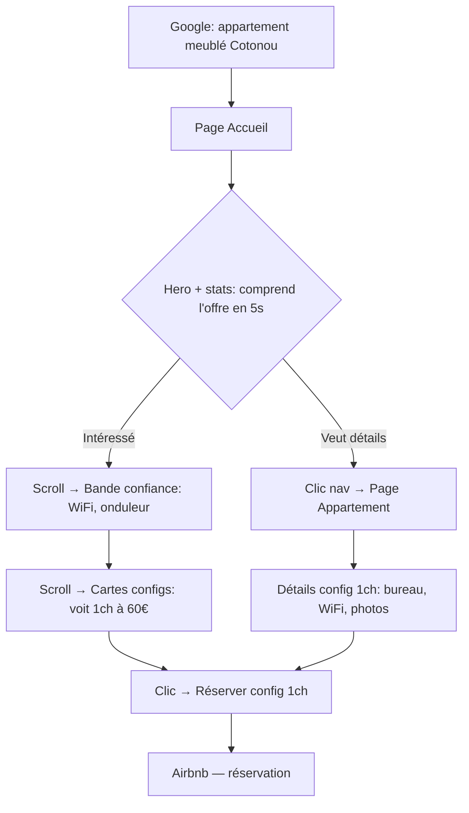
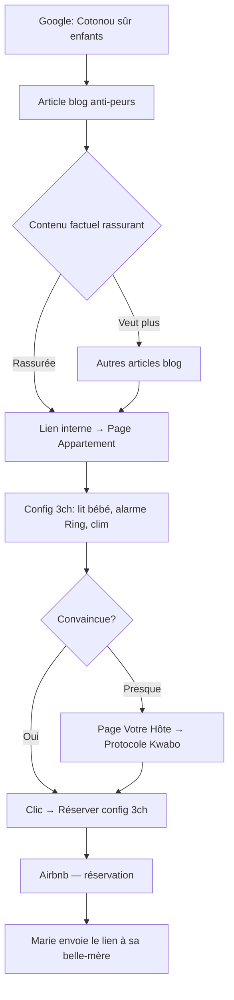
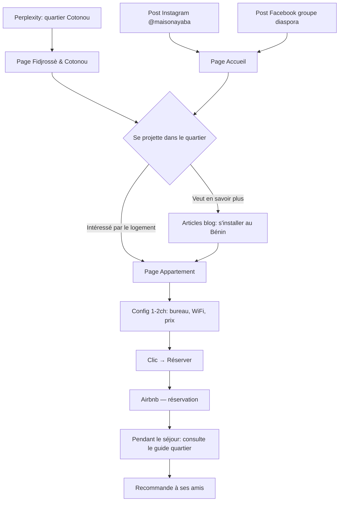
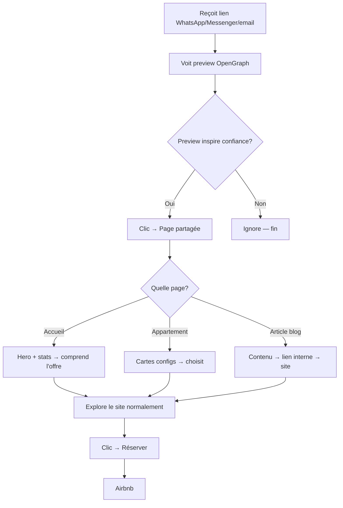
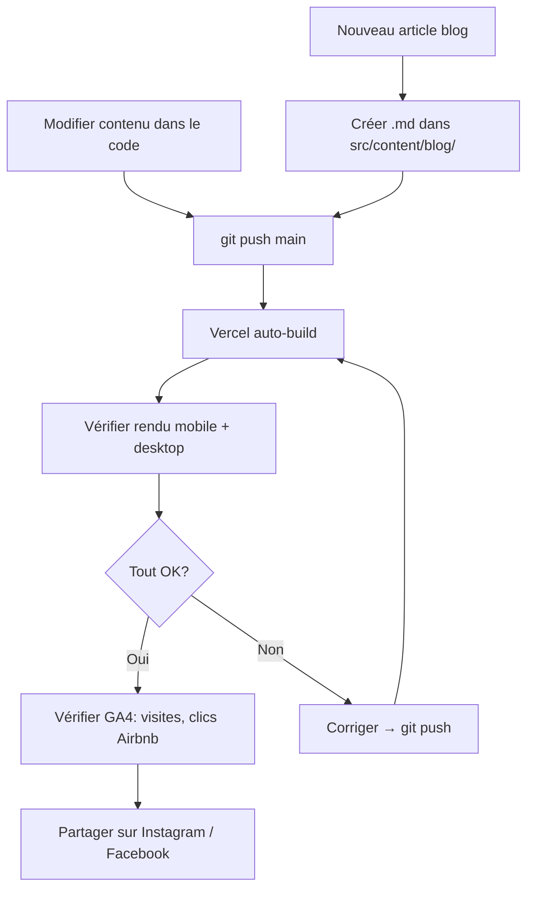

# UX Design Specification maison_ayaba

**Author:** Onizuka
**Date:** 2026-03-14

---

## Executive Summary

### Project Vision

Le site Maison Ayaba est un anxiolytique digital bilingue (FR/EN) qui intercepte les voyageurs en recherche d'hébergement à Cotonou via SEO et moteurs de réponse IA, détruit leurs peurs (coupures, sécurité, confort) point par point, et les convertit vers les 3 annonces Airbnb existantes (configurations 1, 2 et 3 chambres — Maison Wabi-Sabi, Fidjrossè Jacquot). Le site rend visible ce qu'une annonce Airbnb seule ne peut pas communiquer : l'investissement infrastructure (20 000€+), le Protocole Kwabo (accueil anticipatoire signature) et la crédibilité d'une marque hôtelière structurée.

### Target Users

5 personas principales, chacune avec un parcours d'entrée et des besoins UX distincts :

- **Kofi (Voyageur d'affaires)** — Entrée SEO directe ("appartement meublé Cotonou"). Cherche bureau, WiFi, onduleur, calme. Décision rapide sur la config 1 chambre (60-80€/nuit). Moment clé : quand il voit le bureau et l'onduleur sur les photos.
- **Amina & Thomas (Couple en escapade)** — Entrée Google ou bouche-à-oreille. Cherche quartier vivant, plage, restaurants. Sensible à l'ambiance et aux photos. Moment clé : le panier Kwabo et la liste de restaurants du quartier.
- **La Bande à Sena (Groupe d'amis)** — Entrée sociale ou Google. Calcule le prix par personne (~23€/nuit pour 6). Cherche espaces communs, terrasse, activités. Moment clé : le calcul du rapport qualité/prix vs hôtel.
- **Les Mensah (Famille)** — Entrée blog anti-peurs ("Cotonou sûr pour les enfants ?"). Besoin de rassurance maximale : sécurité (Ring, smart lock), équipement bébé, clim. Moment clé : la clim pré-allumée et le lit bébé déjà installé.
- **Fabrice (Explorateur pré-installation)** — Entrée IA (Perplexity, ChatGPT). Cherche à se projeter dans la vie quotidienne à Fidjrossè. Consomme le contenu quartier comme ressource au-delà de l'hébergement.

### Key Design Challenges

1. **Transformer la peur en confiance en quelques secondes** — Le visiteur arrive avec de l'anxiété sur l'Afrique de l'Ouest. Chaque élément (hero, texte, photos, structure) doit rassurer factuellement sans être défensif. Le ton est "transparent et confiant" — on adresse les objections frontalement ("Oui, il y a des coupures. Non, ça ne vous impactera pas — onduleur automatique.").

2. **Guider vers Airbnb sans friction** — Le site ne prend pas de réservation. Le CTA Airbnb doit être omniprésent mais naturel, intégré au parcours de confiance. Le passage du site vers Airbnb ne doit pas casser le sentiment de crédibilité construit.

3. **5 personas, un seul parcours** — Kofi veut un bureau, les Mensah veulent un lit bébé, Fabrice veut le quartier. La page d'accueil et la navigation doivent permettre à chaque persona de trouver son chemin en 1-2 clics maximum, sans que le site paraisse surchargé.

4. **Performance sur réseau lent** — Visiteurs depuis l'Afrique de l'Ouest sur 3G/4G. Images optimisées (WebP/AVIF), lazy loading, HTML statique léger. Chaque Ko compte.

### Design Opportunities

1. **Le contenu anti-peurs comme tunnel de conversion** — Chaque article blog transforme une peur en confiance, puis en découverte de l'appartement, puis en CTA Airbnb. La peur du voyageur est le meilleur levier SEO ET le meilleur levier de conversion.

2. **La modularité comme UX de choix simplifié** — 3 configurations côte à côte avec prix, capacité, équipements et CTA dédié. Le visiteur compare en un coup d'œil et choisit sans friction. Pas de configurateur complexe — juste 3 cartes claires.

3. **Le Protocole Kwabo comme différenciateur émotionnel** — Les micro-attentions (panier bienvenue local, clim pré-allumée, mot manuscrit "Kwabo") créent un lien émotionnel impossible à reproduire sur une annonce Airbnb. Le site les rend tangibles via photos, descriptions et témoignages.

## Core User Experience

### Defining Experience

L'expérience core du site Maison Ayaba est un parcours de **lecture → confiance → action** en 3 temps :

1. **Intercepter** — Le visiteur arrive depuis Google, un moteur IA ou un lien partagé, avec une question ou une peur
2. **Rassurer** — Le contenu détruit l'anxiété point par point avec des faits, des photos et de la transparence
3. **Convertir** — Le visiteur, désormais en confiance, clique vers l'annonce Airbnb correspondant à sa configuration

**Action core :** Lire → être rassuré → cliquer vers Airbnb.

**Action secondaire clé :** Partager le site — le visiteur envoie le lien à un proche (conjoint, ami, famille) comme preuve que "c'est sérieux". Le site fonctionne aussi comme outil de rassurance par procuration (ex : Marie Mensah qui envoie le lien à sa belle-mère).

### Platform Strategy

- **Web responsive, mobile-first** — Pas d'application native. Le site est un MPA statique (Astro 6) servi via CDN
- **Touch-first sur mobile** — Cibles tactiles larges, navigation par scroll vertical, CTA facilement accessibles au pouce
- **Pas de fonctionnalité offline** — Le site est consommé en ligne, pas de PWA nécessaire
- **Réseau 3G/4G comme contrainte de design** — HTML statique léger, images WebP/AVIF, lazy loading. Le site doit être utilisable même sur une connexion lente depuis Cotonou
- **Pas de JavaScript client** — Composants Astro purs, zero hydration, zero framework JS embarqué

### Effortless Interactions

**Ce qui doit être instantané et sans friction :**

- **CTA Airbnb toujours visible** — Bouton sticky sur mobile qui reste accessible sans scroller. Le visiteur ne doit jamais chercher comment réserver
- **Choix de configuration en un coup d'œil** — Les 3 configurations (1/2/3 chambres) présentées côte à côte avec prix, capacité et CTA dédié. Pas de menu déroulant, pas de filtre — juste 3 cartes comparables
- **Changement de langue sans perdre le contexte** — Le sélecteur FR/EN redirige vers la même page dans l'autre langue, pas vers la page d'accueil
- **Partage du site** — Le lien partagé doit générer un aperçu riche (og:image, og:title, og:description) sur WhatsApp, Messenger, iMessage. Le site est un outil de rassurance par procuration — l'aperçu doit inspirer confiance avant même le clic

**Ce qui doit disparaître :**

- Zéro popup, zéro newsletter, zéro cookie banner intrusif (pas de cookies de tracking tiers, uniquement GA4)
- Pas de formulaire de contact en Phase 1 — le canal est WhatsApp/Airbnb
- Pas de carrousel auto-play — les photos sont consultées à la demande

### Critical Success Moments

1. **Les 5 premières secondes (make or break)** — Le hero + accroche "Tout le confort que vous attendez. À Cotonou." doit immédiatement communiquer : c'est beau, c'est pro, c'est à Cotonou, c'est abordable. Si le visiteur ne ressent pas "ah, ça existe ?" dans les 5 secondes, il repart sur Google.

2. **Le moment "objection retournée"** — Quand le visiteur lit la section sur les coupures d'électricité et découvre l'onduleur automatique. C'est le basculement de "intéressant" à "je réserve". Ce pattern (adresser la peur → montrer la solution) doit être reproductible sur chaque objection.

3. **Le moment "prix par personne"** — Quand le groupe ou la famille calcule le coût par personne (~23€/nuit pour 6) vs le prix d'une chambre d'hôtel (200€). Ce calcul doit être facilité par le site, pas laissé à l'initiative du visiteur.

4. **Le moment "partage"** — Quand le visiteur envoie le lien du site à un proche. L'aperçu OpenGraph doit être soigné : photo invitante, titre clair, description rassurante. C'est la vitrine de la vitrine.

### Experience Principles

1. **Rassurer d'abord, vendre ensuite** — Chaque page adresse d'abord les peurs du visiteur avant de proposer une action. La confiance précède toujours la conversion.

2. **Montrer, ne pas dire** — Photos réelles de l'appartement, équipements visibles, prix affichés, transparence sur les limites (coupures). Pas de superlatifs vides — des preuves.

3. **Un clic de moins, toujours** — Chaque interaction supprimée est un visiteur de plus qui arrive au CTA Airbnb. CTA sticky, navigation minimale, choix de configuration en un regard.

4. **Le site est un outil de partage** — Le visiteur partage le lien comme preuve de crédibilité. Chaque page doit être autonome et compréhensible quand reçue hors contexte (via WhatsApp, email, réseaux sociaux).

5. **Léger comme le réseau** — Performance = respect du visiteur. HTML statique, images optimisées, zero JS superflu. Le site charge vite même sur 3G depuis Cotonou.

## Desired Emotional Response

### Primary Emotional Goals

**Émotion dominante : Le soulagement** — "J'ai trouvé. C'est sérieux. C'est réglé." Le visiteur quitte le site avec le calme de savoir que tout est anticipé. Pas l'excitation du luxe ou l'euphorie d'une bonne affaire — le soulagement profond d'avoir trouvé un hébergement fiable dans un contexte où la fiabilité est rare.

**Émotion de partage : La sérénité contagieuse** — Quand le visiteur envoie le lien, le message implicite est : "Regarde, ça existe — on peut y aller sereinement." Le site transforme le partageur en ambassadeur de confiance.

**Émotion de surprise : Le Protocole Kwabo** — Le moment où le visiteur passe de "c'est fiable" à "c'est spécial". La découverte des micro-attentions (panier bienvenue local, clim pré-allumée, mot manuscrit "Kwabo") provoque un plaisir inattendu — quelqu'un a pensé à tout, y compris à ce qu'on n'aurait pas demandé.

### Emotional Journey Mapping

| Étape | Émotion d'entrée | Émotion cible | Déclencheur UX |
|-------|-------------------|---------------|----------------|
| **Arrivée sur le site** | Anxiété, doute ("est-ce que ça va être bien au Bénin ?") | Curiosité rassurée ("ah, ça a l'air sérieux") | Hero image invitante + accroche "Tout le confort que vous attendez. À Cotonou." |
| **Exploration des pages** | Scepticisme prudent ("trop beau pour être vrai ?") | Confiance croissante ("ils adressent mes vrais doutes") | Transparence sur les coupures, photos réelles, équipements visibles, prix affichés |
| **Découverte du Protocole Kwabo** | Confiance rationnelle | Surprise + plaisir ("ils ont pensé à ça ?!") | Description des micro-attentions : panier bienvenue, clim pré-allumée, lit bébé, mot manuscrit |
| **Choix de configuration** | Intérêt actif | Décision sereine ("c'est clair, je sais lequel me convient") | 3 cartes côte à côte, prix, capacité, CTA dédié |
| **Clic vers Airbnb** | Confiance acquise | Soulagement ("c'est réglé, j'arrête de chercher") | CTA clair, transition fluide vers Airbnb |
| **Partage du lien** | Envie de rassurer un proche | Fierté discrète ("j'ai trouvé le bon plan") | Aperçu OpenGraph soigné, pages autonomes et compréhensibles hors contexte |

### Micro-Emotions

**À cultiver :**
- **Confiance** vs Scepticisme — Transparence, preuves visuelles, ton factuel. Jamais de promesses vagues
- **Soulagement** vs Anxiété — Chaque objection adressée = une anxiété de moins. L'accumulation de réponses crée le soulagement
- **Surprise agréable** vs Satisfaction neutre — Le Protocole Kwabo est le moment qui élève l'expérience au-dessus du "correct" vers le "mémorable"
- **Clarté** vs Confusion — 3 configurations, prix visibles, navigation minimale. Le visiteur ne doute jamais de ce qu'il regarde

**À éviter absolument :**
- **Le doute** — Toute ambiguïté (prix caché, photo trop retouchée, promesse floue) détruit la confiance en construction
- **La pression** — Zéro urgence artificielle ("il ne reste que 2 nuits !"), zéro popup agressif. La confiance ne se construit pas sous pression
- **La déception du clic** — Le passage du site vers Airbnb ne doit pas créer un décalage émotionnel. L'annonce Airbnb doit refléter la qualité du site

### Design Implications

| Émotion cible | Approche UX |
|---------------|-------------|
| **Soulagement** | Ton factuel et transparent. Adresser les peurs frontalement avec des réponses concrètes ("Oui, il y a des coupures. Onduleur automatique."). Structure de page : objection → réponse → preuve |
| **Confiance** | Photos réelles (pas de stock photos), prix affichés sans astérisque, avis Airbnb intégrés, page Hôte avec visage et histoire. Chaque élément est une preuve |
| **Surprise (Kwabo)** | Section dédiée visuellement distincte — couleur ou mise en page différente pour marquer le changement de registre. Photos des détails (panier, mot manuscrit, fruit local). C'est le moment émotionnel du site |
| **Clarté** | 3 cartes de configuration côte à côte, jamais plus de 5 items dans une nav, hiérarchie visuelle forte (titres > sous-titres > texte), espacement généreux |
| **Sérénité de partage** | og:image soignée sur chaque page, descriptions meta qui rassurent, pages autonomes qui font sens même reçues hors contexte via WhatsApp |

### Emotional Design Principles

1. **La confiance se construit par accumulation** — Chaque section, chaque photo, chaque prix affiché ajoute une couche de confiance. Il n'y a pas de "moment confiance" unique — c'est l'accumulation qui produit le soulagement final.

2. **La surprise vient après la confiance** — Le Protocole Kwabo ne fonctionne émotionnellement que si le visiteur fait déjà confiance. Présenter les micro-attentions trop tôt (avant d'avoir détruit les peurs) les ferait paraître comme du marketing. L'ordre est : rassurer → puis surprendre.

3. **Le ton est un ami bien informé, pas un vendeur** — Quelqu'un qui connaît Cotonou et qui dit les choses comme elles sont. Factuel, chaleureux, jamais défensif. "Oui, il y a des coupures" — pas "ne vous inquiétez pas pour les coupures".

4. **Zéro friction émotionnelle** — Chaque élément qui crée du doute, de la confusion ou de la pression est un ennemi. Le site est un espace de calme dans un processus de recherche stressant.

## UX Pattern Analysis & Inspiration

### Inspiring Products Analysis

**1. Sofitel Cotonou (sofitel.accor.com) — Référence structurelle**

Le site du Sofitel Cotonou utilise un pattern "hero → chambres → services → quartier" qui fonctionne bien pour l'hospitalité. Les chambres sont visibles dès la page d'accueil sous forme de cartes avec photo, capacité et CTA. La densité d'information est progressive — léger en haut, détaillé en bas. Le site affiche 843 avis et une note 4.7/5 en haut de page comme preuve sociale immédiate.

**Ce qu'on retient :** La structure "voir les chambres sans chercher" et les cartes de configuration avec les infos essentielles (photo, capacité, prix, CTA).

**Ce qu'on ne copie pas :** Le ton luxe 5 étoiles, le moteur de réservation intégré, la navigation multi-niveaux complexe (trop lourd pour un site 5 pages).

**2. Pattern "Landing page anti-peurs" (sites SaaS/fintech de confiance)**

Les meilleurs sites de conversion dans des marchés où la confiance est un frein (fintech, santé, assurance) utilisent un pattern récurrent : objection → réponse → preuve. Chaque section de la page adresse une peur spécifique, y répond factuellement, et montre une preuve (témoignage, chiffre, photo). C'est exactement le mécanisme dont Maison Ayaba a besoin.

**Ce qu'on retient :** La structure "objection → réponse → preuve" comme pattern de section répétable sur la page d'accueil et les articles blog.

**3. Pattern "Comparateur simplifié" (sites e-commerce/télécom)**

Les sites de forfaits télécom ou SaaS présentent 3 offres côte à côte avec des cartes comparatives : nom, prix, caractéristiques clés, CTA. Le visiteur compare en un regard et choisit. Pas de configurateur, pas de filtre — juste 3 options claires.

**Ce qu'on retient :** 3 cartes de configuration côte à côte (1ch/2ch/3ch) avec prix, capacité, équipements clés et CTA Airbnb dédié. Pattern éprouvé pour la décision rapide.

### Transferable UX Patterns

**Navigation :**
- **Nav minimale (5 items max)** — Accueil, Appartement, Quartier, Hôte, Réserver. Pas de sous-menus, pas de dropdowns. Le visiteur voit toutes les options d'un coup
- **Sticky header sur mobile** — Logo + hamburger menu + CTA Airbnb toujours visible au scroll

**Conversion :**
- **Cartes de configuration côte à côte** — 3 cartes comparatives (1ch/2ch/3ch) avec photo, prix, capacité, équipements clés, CTA dédié. Visibles sur la page d'accueil ET la page Appartement
- **CTA sticky mobile** — Bouton "Réserver sur Airbnb" flottant en bas de l'écran sur mobile, toujours accessible
- **Prix affichés sans clic** — Le prix est visible directement sur la carte, pas derrière un "Voir les tarifs"

**Confiance :**
- **Structure objection → réponse → preuve** — Pattern de section réutilisable : titre = la peur ("Les coupures d'électricité"), texte = la réponse factuelle, visuel = la preuve (photo onduleur)
- **Avis Airbnb intégrés** — Note et extraits d'avis visibles sur la page d'accueil, pas cachés dans une sous-page
- **Page Hôte avec visage** — Photo réelle, histoire personnelle, philosophie. Humanise la marque

**Contenu :**
- **Blog comme tunnel de conversion** — Chaque article suit le pattern : peur SEO → réponse factuelle → découverte de l'appartement → CTA Airbnb. L'article est autonome mais toujours relié au produit

### Anti-Patterns to Avoid

- **Carrousel auto-play** — Les photos défilent seules et le visiteur rate ce qu'il voulait voir. Galerie manuelle uniquement
- **"Il ne reste que X nuits !"** — Urgence artificielle qui détruit la confiance. Contradictoire avec le positionnement "sérénité"
- **Moteur de recherche/dates sur la homepage** — On n'est pas Booking.com. Pas de sélecteur de dates, pas de widget de recherche. Le CTA est un lien direct vers Airbnb
- **Popup newsletter au premier scroll** — Le visiteur n'a même pas encore confiance et on lui demande son email. Zéro popup
- **Stock photos** — Une seule photo générique et la confiance s'effondre. Uniquement des photos réelles de Maison Wabi-Sabi
- **Navigation multi-niveaux** — Le Sofitel a des menus à 3 niveaux parce que c'est un réseau de 200+ hôtels. Nous avons 5 pages — une nav plate suffit
- **Prix cachés derrière un clic** — "Voir les tarifs" crée du doute. Les prix sont affichés directement sur les cartes

### Design Inspiration Strategy

**Adopter :**
- Structure "hero → configurations → Kwabo → quartier → CTA" sur la page d'accueil (inspiré du pattern hôtelier Sofitel)
- Cartes de configuration comparatives côte à côte (pattern télécom/SaaS)
- CTA sticky mobile en bas d'écran (pattern e-commerce mobile)
- Avis intégrés visibles sans clic (pattern marketplace)

**Adapter :**
- Le pattern hôtelier "chambres sur la homepage" → adapté en "3 configurations Maison Wabi-Sabi" avec prix par nuit ET prix par personne
- Le pattern "objection → réponse → preuve" → adapté aux peurs spécifiques du voyageur en Afrique de l'Ouest (coupures, sécurité, confort, transport)
- Le pattern blog SEO → adapté en "tunnel anti-peurs" où chaque article convertit vers Airbnb

**Éviter :**
- Tout pattern de site hôtelier chaîne (moteur de réservation, navigation complexe, widget dates)
- Tout pattern d'urgence ou de pression (scarcity, countdown, popup)
- Tout pattern qui ajoute un clic entre le visiteur et l'information (accordéons, tabs, "voir plus")

## Design System Foundation

### Design System Choice

**Tailwind CSS custom — sans librairie de composants tierce.**

Système de design sur-mesure construit directement dans Tailwind via `tailwind.config.mjs` : tokens de couleurs, typographie, espacement et composants `.astro` custom. Pas de DaisyUI, pas de shadcn, pas de librairie externe.

### Rationale for Selection

- **~10 composants UI** — pas besoin d'une librairie de 50+ composants pour un site de 5 pages
- **Composants Astro `.astro`** — incompatibles avec les librairies React/Vue (shadcn, MUI, Chakra)
- **Identité visuelle propre** — le site doit ressembler à Maison Ayaba, pas à un template
- **Solo dev expérimenté** — Tailwind utility-first est le workflow le plus productif sans dépendance tierce
- **Performance** — zero CSS de librairie inutilisé, uniquement ce qui est utilisé

### Implementation Approach

**Direction visuelle : Minimalisme chaleureux**

Beaucoup d'espace blanc, typographie soignée, touches de couleur terre/or limitées aux accents. Sobre comme un bel appartement bien rangé — pas froid comme un site tech, pas chargé comme un site de voyage.

**Fond blanc** comme base, pour :
- Propreté et clarté — qualités qu'un voyageur anxieux cherche dans un hébergement
- Photos d'appartement qui ressortent naturellement
- Couleurs terre/ocre du logo qui brillent sur fond clair
- Lisibilité optimale sur mobile en plein soleil (Cotonou)

**Palette de couleurs (extraite du logo Maison Ayaba) :**

| Token | Rôle | Couleur | Usage |
|-------|------|---------|-------|
| `ayaba-terra` | Couleur primaire | Terracotta/brun chaud (#A0522D approx.) | Titres, liens, navigation active, CTA secondaires |
| `ayaba-gold` | Accent premium | Or/doré (#C8A45C approx.) | Accents Kwabo, badges, éléments de surprise, hover |
| `ayaba-cream` | Surface chaude | Crème (#FAF7F2 approx.) | Fonds de sections alternées (rompt la monotonie du blanc pur) |
| `white` | Surface principale | Blanc (#FFFFFF) | Fond de page, cartes |
| `ayaba-dark` | Texte principal | Brun très foncé (#2C1810 approx.) | Corps de texte (plus chaud que le noir pur) |
| `ayaba-muted` | Texte secondaire | Gris chaud (#6B5E57 approx.) | Sous-titres, légendes, texte d'aide |
| `ayaba-success` | Validation | Vert olive (#5A7247 approx.) | Éléments de rassurance (check, "onduleur inclus") |

**Note :** Les codes hex exacts seront affinés lors de l'implémentation en les calibrant visuellement avec le logo définitif. Les valeurs ci-dessus sont des directions, pas des absolus.

**Typographie :**

| Rôle | Font | Style | Rationale |
|------|------|-------|-----------|
| Titres (h1, h2) | **Playfair Display** (serif) | Élégant, éditorial | Registre premium sobre, évoque le magazine de voyage haut de gamme. Le serif apporte la gravité et la crédibilité |
| Corps de texte | **Inter** (sans-serif) | Propre, lisible | Excellente lisibilité sur écran et mobile, neutre et moderne. Ne fatigue pas sur les longs textes (blog) |
| Accents / CTA | **Inter Semi-Bold** | Direct, confiant | Même famille que le corps pour la cohérence, semi-bold pour les éléments d'action |

Le contraste serif (titres) / sans-serif (corps) crée une hiérarchie visuelle immédiate et un registre "éditorial premium" — le visiteur perçoit inconsciemment que c'est soigné.

**Espacement et rythme :**

- Espacement généreux entre les sections (pas d'entassement — le blanc respire)
- Sections alternées blanc / crème pour créer un rythme visuel sans surcharger
- Padding large sur mobile (le contenu ne touche jamais les bords)
- Hiérarchie typographique forte : h1 > h2 > h3 > body nettement différenciés en taille et graisse

### Customization Strategy

**Tokens Tailwind (`tailwind.config.mjs`) :**

```js
colors: {
  ayaba: {
    terra: '#A0522D',    // Primaire — terracotta
    gold: '#C8A45C',     // Accent — or
    cream: '#FAF7F2',    // Surface chaude
    dark: '#2C1810',     // Texte principal
    muted: '#6B5E57',    // Texte secondaire
    success: '#5A7247',  // Rassurance
  }
}
fontFamily: {
  heading: ['Playfair Display', 'Georgia', 'serif'],
  body: ['Inter', 'system-ui', 'sans-serif'],
}
```

**Composants UI custom (liste complète) :**

| Composant | Rôle | Tokens utilisés |
|-----------|------|-----------------|
| `AirbnbCta.astro` | Bouton réservation Airbnb + tracking GA4 | `ayaba-terra` fond, blanc texte, `ayaba-gold` hover |
| `ApartmentCard.astro` | Carte de configuration (1ch/2ch/3ch) | `white` fond, `ayaba-terra` prix, `ayaba-dark` texte |
| `HeroSection.astro` | Hero image + accroche | Image plein-cadre, texte blanc sur overlay sombre |
| `Header.astro` | Navigation + sélecteur langue | `white` fond, `ayaba-terra` liens actifs |
| `Footer.astro` | Liens, copyright | `ayaba-dark` fond, `ayaba-cream` texte |
| `Button.astro` | Bouton générique | Variantes : primary (terra), secondary (outline), ghost |
| `LanguageSwitcher.astro` | Toggle FR/EN | Discret, `ayaba-muted` texte |
| `ImageGallery.astro` | Galerie photos manuelle | Fond blanc, navigation dots `ayaba-terra` |
| `MetaTags.astro` | SEO head tags | N/A (pas de rendu visuel) |
| `SchemaOrg.astro` | Données structurées | N/A (pas de rendu visuel) |

**Règle de design stricte :** Les couleurs d'accent (`ayaba-gold`, `ayaba-success`) sont utilisées avec parcimonie — maximum 2-3 occurrences par page. L'excès de couleur tue le premium. Le blanc et le texte font le travail principal.

## Defining Core Experience

### Defining Experience

**L'expérience Maison Ayaba en une phrase :** "Je cherchais un hébergement à Cotonou, j'ai trouvé un site qui a répondu à toutes mes questions, et j'ai réservé un appartement entier à une fraction du prix d'un hôtel."

C'est un parcours de **découverte → rassurance → décision** — pas une interaction technique complexe. L'expérience définissante n'est pas un geste (swipe, clic), c'est une **transformation émotionnelle** : le visiteur entre anxieux et sort soulagé.

**Le moment où tout bascule :** Quand le visiteur réalise que quelqu'un a anticipé exactement ses peurs et y a répondu honnêtement. Ce n'est pas un moment UI — c'est un moment de contenu. Le design est au service de ce contenu.

### User Mental Model

**Comment les visiteurs résolvent le problème aujourd'hui :**

| Parcours actuel | Friction | Ce que Maison Ayaba change |
|-----------------|----------|---------------------------|
| **Google → Airbnb direct** | Annonces sans contexte, photos moyennes, pas de rassurance sur les peurs (coupures, sécurité, quartier). Le voyageur hésite et compare 20 annonces | Le site pré-filtre et pré-rassure. Quand le visiteur arrive sur Airbnb, il a déjà confiance — il réserve |
| **Bouche-à-oreille** | Dépend d'avoir un contact qui connaît Cotonou. Informations fragmentées, pas de preuve | Le site EST le bouche-à-oreille digitalisé. Le visiteur peut le partager comme preuve ("regarde, c'est sérieux") |
| **Hôtels (Novotel, Azalaï)** | 200€/nuit pour une chambre, localisation excentrée, pas de cuisine ni de machine à laver | Le site montre la comparaison : appartement entier vs chambre d'hôtel, avec le prix par personne |
| **Entreprises réservant pour collaborateurs** | Besoin de fiabilité, facturation pro, décision rapide. Pas le temps de comparer 20 Airbnb | Le site sert de vitrine professionnelle crédible — l'entreprise voit une marque structurée, pas une annonce amateur (Phase 2 : page corporate dédiée) |

**Modèle mental du visiteur :**
- Il s'attend à un site d'hébergement classique (photos, prix, bouton réserver)
- Il ne s'attend PAS à ce que le site adresse ses peurs — c'est là que la surprise positive se produit
- Il compare mentalement avec les hôtels ET avec les autres Airbnb
- Sur mobile, il scrolle verticalement et scanne les titres avant de lire le détail

### Success Criteria

**Le visiteur dit "ça marche" quand :**

1. **Il comprend l'offre en < 30 secondes** — Hero + accroche + 3 configurations visibles = "j'ai compris ce que c'est et combien ça coûte"
2. **Il trouve la réponse à sa peur sans chercher** — La page d'accueil ou le blog adresse sa peur spécifique (coupures, sécurité, transport) directement et factuellement
3. **Il choisit sa configuration sans hésiter** — Les 3 cartes sont assez claires pour décider : "1 chambre, ça me va, 60€, je clique"
4. **Il clique vers Airbnb en confiance** — Le CTA est visible, le lien fonctionne, la transition ne casse pas la confiance
5. **Il partage le lien facilement** — L'aperçu WhatsApp/Messenger est propre et inspire confiance

**Indicateurs d'échec :**
- Le visiteur cherche le prix → il est caché ou ambigu
- Le visiteur cherche le bouton réserver → il doit scroller ou naviguer pour le trouver
- Le visiteur partage le lien → l'aperçu est vide ou générique
- Le visiteur arrive depuis le blog → il ne comprend pas que c'est aussi un hébergement

### Novel UX Patterns

**Aucun pattern novel nécessaire.** Le site utilise exclusivement des patterns établis que les visiteurs comprennent déjà :

- Navigation horizontale avec menu (pattern universel)
- Cartes comparatives côte à côte (pattern e-commerce/télécom)
- Hero image + accroche (pattern site vitrine)
- Blog avec articles (pattern contenu)
- CTA bouton vers lien externe (pattern marketplace)

**L'innovation est dans le contenu, pas dans l'interface.** Le pattern "objection → réponse → preuve" n'est pas un pattern UI nouveau — c'est une stratégie de contenu appliquée à un site d'hébergement. L'interface est volontairement familière pour que le visiteur n'ait aucun effort cognitif à fournir et puisse se concentrer sur le message.

**Twist unique de Maison Ayaba :** Le CTA sticky mobile "Réserver sur Airbnb" avec le prix visible. Ce n'est pas nouveau en soi (les sites e-commerce le font), mais c'est rare dans l'hospitalité indépendante. Le visiteur sait à tout moment combien ça coûte et comment réserver — sans scroller.

### Experience Mechanics

**1. Initiation — Le visiteur arrive sur le site**

| Source d'entrée | Page d'atterrissage | Premier élément vu |
|-----------------|---------------------|--------------------|
| Google requête directe | Page d'accueil | Hero + accroche + 3 configs |
| Google requête peur | Article blog | Titre répondant à la peur + contenu factuel |
| Moteur IA (Perplexity, ChatGPT) | Page quartier ou accueil | Contenu factuel structuré (schema.org) |
| Lien partagé (WhatsApp, email) | Page partagée | Aperçu OpenGraph soigné → page complète |
| Recommandation entreprise | Page d'accueil | Vitrine professionnelle crédible |

**2. Interaction — Le visiteur explore**

- **Scroll vertical** comme interaction principale — le contenu défile naturellement
- **Clics de navigation** limités : menu → page, carte config → Airbnb, article → article lié
- **Aucune saisie utilisateur** — pas de formulaire, pas de recherche, pas de filtre
- **Changement de langue** via le sélecteur FR/EN (seule interaction de "configuration")

**3. Feedback — Le visiteur sait qu'il avance**

- **Navigation active** — l'item de menu courant est visuellement distinct (couleur `ayaba-terra`)
- **Sections qui répondent** — chaque section du scroll adresse une question/peur → le visiteur "coche mentalement" ses préoccupations
- **Prix toujours visibles** — le CTA sticky mobile avec le prix rappelle en permanence "tu es au bon endroit, voici combien ça coûte"
- **Pas de feedback d'erreur** — il n'y a rien à rater sur un site de contenu statique

**4. Completion — Le visiteur passe à l'action**

- **Clic CTA Airbnb** = conversion. Le visiteur quitte le site vers Airbnb avec la confiance acquise
- **Partage du lien** = conversion secondaire. Le visiteur envoie l'URL à un proche
- **Bookmark / retour** = le visiteur garde le site comme ressource (guide quartier, articles blog) pendant son séjour
- **Pas de "fin" formelle** — le site reste utile après la réservation (pendant le séjour pour le guide quartier, après pour recommander)

## Visual Design Foundation

### Color System

**Palette complète avec ratios de contraste :**

| Token | Hex | Sur blanc (#FFF) | Sur crème (#FAF7F2) | Rôle |
|-------|-----|------------------|---------------------|------|
| `ayaba-terra` | #A0522D | 4.8:1 ✅ AA | 4.5:1 ✅ AA | Primaire — titres, liens, CTA |
| `ayaba-gold` | #C8A45C | 2.8:1 ❌ (décoratif uniquement) | 2.6:1 ❌ | Accent — badges, hover, détails Kwabo |
| `ayaba-dark` | #2C1810 | 14.7:1 ✅ AAA | 13.8:1 ✅ AAA | Texte principal |
| `ayaba-muted` | #6B5E57 | 4.6:1 ✅ AA | 4.3:1 ⚠️ AA large | Texte secondaire |
| `ayaba-success` | #5A7247 | 4.5:1 ✅ AA | 4.2:1 ⚠️ AA large | Rassurance (checks, confirmations) |
| `ayaba-cream` | #FAF7F2 | N/A (surface) | N/A | Fond de sections alternées |
| `white` | #FFFFFF | N/A (surface) | N/A | Fond principal |

**Règles d'usage couleur :**
- `ayaba-gold` JAMAIS utilisé pour du texte seul — uniquement en décoration, bordures, icônes accompagnées de texte
- `ayaba-muted` réservé aux textes de grande taille (16px+) ou aux légendes secondaires
- Texte courant toujours en `ayaba-dark` sur fond blanc ou crème
- CTA primaire : fond `ayaba-terra`, texte blanc (#FFF) — ratio 7.2:1 ✅ AAA

**Sémantique des couleurs :**

| Contexte | Couleur | Exemple |
|----------|---------|---------|
| Action principale | `ayaba-terra` | Bouton "Réserver sur Airbnb" |
| Action secondaire | `ayaba-terra` outline | Bouton "Voir l'appartement" |
| Élément premium/spécial | `ayaba-gold` | Badge Protocole Kwabo, séparateur décoratif |
| Rassurance | `ayaba-success` | Icône check "Onduleur inclus", "WiFi fiable" |
| Navigation active | `ayaba-terra` | Item de menu de la page courante |
| Lien texte | `ayaba-terra` | Liens inline dans le contenu |
| Lien hover | `ayaba-terra` assombri (~#8B4726) | État hover des liens |

### Typography System

**Échelle typographique (base 16px, ratio 1.25 — Major Third) :**

| Niveau | Taille mobile | Taille desktop | Graisse | Font | Line-height | Usage |
|--------|---------------|----------------|---------|------|-------------|-------|
| h1 | 28px (1.75rem) | 40px (2.5rem) | 700 | Playfair Display | 1.2 | Titre de page, hero accroche |
| h2 | 24px (1.5rem) | 32px (2rem) | 700 | Playfair Display | 1.25 | Titres de sections |
| h3 | 20px (1.25rem) | 24px (1.5rem) | 600 | Inter | 1.3 | Sous-titres, noms de configuration |
| body | 16px (1rem) | 18px (1.125rem) | 400 | Inter | 1.6 | Corps de texte, articles blog |
| small | 14px (0.875rem) | 14px (0.875rem) | 400 | Inter | 1.5 | Légendes, texte d'aide, copyright |
| cta | 16px (1rem) | 16px (1rem) | 600 | Inter | 1 | Texte des boutons CTA |

**Règles typographiques :**
- Titres (h1, h2) en Playfair Display — apportent le registre éditorial premium
- Tout le reste en Inter — lisibilité maximale, neutre, professionnel
- Jamais de texte sous 14px — accessibilité mobile
- Line-height corps ≥ 1.5 — confort de lecture (blog, descriptions longues)
- Longueur de ligne maximale : 75 caractères (≈ `max-w-prose` en Tailwind) — lisibilité optimale

**Chargement des fonts :**
- Google Fonts avec `font-display: swap` — le texte s'affiche immédiatement en fallback (Georgia / system-ui) puis bascule quand la font est chargée
- Préchargement des 2 fonts en `<link rel="preload">` dans le `<head>`
- Subset latin uniquement (pas de caractères non-utilisés) — réduction du poids

### Spacing & Layout Foundation

**Système d'espacement (base 4px) :**

| Token Tailwind | Valeur | Usage |
|----------------|--------|-------|
| `1` | 4px | Micro-espacement (entre icône et texte) |
| `2` | 8px | Espacement interne compact (padding badge) |
| `3` | 12px | Espacement entre éléments proches (items de liste) |
| `4` | 16px | Padding standard mobile, gap entre cartes |
| `6` | 24px | Padding standard desktop, espace entre paragraphes |
| `8` | 32px | Marge entre sous-sections |
| `12` | 48px | Marge entre sections sur mobile |
| `16` | 64px | Marge entre sections sur desktop |
| `20` | 80px | Espace hero, séparation majeure |
| `24` | 96px | Padding vertical des grandes sections |

**Grille :**
- Container max-width : `1280px` (`max-w-7xl`)
- Padding horizontal container : `16px` mobile, `24px` tablette, `32px` desktop
- Grille responsive : 1 colonne mobile → 2 colonnes tablette → 3 colonnes desktop (pour les cartes de configuration)
- Le contenu texte (blog, descriptions) est limité à `max-w-prose` (~65ch) pour le confort de lecture

**Principes de layout :**
- **Sections alternées blanc/crème** — rythme visuel sans bordure ni séparateur
- **Espacement vertical généreux** — le contenu respire, pas d'entassement. Le blanc est un élément de design, pas du vide
- **Padding mobile confortable** — le contenu ne touche jamais les bords de l'écran (minimum 16px)
- **Cartes de configuration** — hauteur égale (CSS Grid `align-items: stretch`), le CTA toujours en bas de la carte
- **Hero pleine largeur** — l'image sort du container sur la page d'accueil pour l'impact visuel

### Accessibility Considerations

**WCAG 2.1 AA — Engagements :**

- **Contraste texte :** Minimum 4.5:1 pour le texte courant, 3:1 pour le texte large (≥ 18px bold ou ≥ 24px)
- **Contraste éléments UI :** Minimum 3:1 pour les bordures, icônes et éléments interactifs
- **Taille de cible tactile :** Minimum 44×44px pour tous les éléments cliquables sur mobile (boutons, liens de navigation, CTA)
- **Focus visible :** Outline `ayaba-terra` 2px sur tous les éléments interactifs lors de la navigation clavier
- **Alt text :** Obligatoire et descriptif sur toutes les images (`<Image>` Astro avec `alt`)
- **Hiérarchie de titres :** h1 → h2 → h3 respectée strictement (pas de saut de niveau)
- **HTML sémantique :** `<header>`, `<main>`, `<nav>`, `<article>`, `<section>`, `<footer>` — navigation par landmarks
- **Skip to content :** Lien invisible au focus qui saute directement au contenu principal
- **Couleur non-suffisante :** L'information n'est jamais transmise uniquement par la couleur — toujours accompagnée de texte ou d'icône
- **Reduced motion :** `prefers-reduced-motion` respecté — pas d'animation si l'utilisateur l'a désactivé (transitions désactivées)

## Design Direction Decision

### Design Directions Explored

6 directions ont été générées, évaluées par le fondateur et 4 testeurs externes (Jeremy, Fao, Jordan, Gwen), puis une 7e direction hybride a été construite à partir des meilleurs éléments :

1. **Éditorial Classique** — Hero sombre centré, cartes sur fond crème
2. **Minimaliste Aéré** — Hero split, CTA arrondis, espace blanc généreux
3. **Immersif Photographique** — Hero pleine hauteur, overlay, bandeau chiffres
4. **Corporate Sobre** — Nav visible, badge + chiffres, bande de confiance
5. **Storytelling Scroll** — Narration verticale alternée image/texte
6. **Grille Magazine** — Layout éditorial asymétrique, bordures

Fichier de référence : `_bmad-output/planning-artifacts/ux-design-directions.html`

### Feedback Testeurs

- **Jeremy** : Corporate préféré pour la conversion (chiffres visibles immédiatement, CTA dans la nav). Immersif préféré pour l'effet "wahou"
- **Fao** : Préfère l'hybride. Insight clé : le site redirige vers Airbnb, donc l'objectif est de "vanter les points forts" — le storytelling est important
- **Jordan** : Minimaliste
- **Gwen** : Immersif. Feedback critique sur la copie Kwabo : "Posez vos valises, on s'occupe du reste" au lieu de "On a pensé à tout avant vous" (verbe d'action, moins arrogant, plus vendeur)
- **Onizuka** : Hybride et Immersif

### Chosen Direction

**Direction hybride : "Immersif-Minimaliste avec socle Corporate"**

Combinaison des meilleurs éléments validés par les 5 testeurs, avec ajustement post-feedback (chiffres intégrés dans le hero pour la conversion) :

**Structure de la page d'accueil :**

1. **Nav** (Dir. 4 Corporate) — Sobre, logo + liens + CTA "Réserver" à droite + sélecteur FR/EN. Sticky sur scroll
2. **Hero** (Dir. 3 Immersif + Dir. 4 Corporate) — Photo salon pleine largeur/hauteur, overlay sombre, accroche + **chiffres clés intégrés dans le hero** (60€, 3 configs, 6 voyageurs, plage 10 min) + 2 CTA (primaire "Réserver" + secondaire "Découvrir l'appartement"). Tout visible au-dessus de la ligne de flottaison — pas besoin de scroller pour comprendre l'offre
3. **Bande de confiance** (Dir. 4 Corporate) — Fond crème, 4 items avec icônes : éléments de rassurance clés (wording à finaliser par l'hôte — adapter selon les vrais services proposés)
4. **Cartes configurations** (Dir. 2 Minimaliste) — 3 cartes aérées côte à côte, bordures douces 16px radius, photo + nom + sous-titre + prix + features avec checks verts + CTA outline "Réserver"
5. **Section Kwabo** (Copie Gwen) — Fond crème, ligne dorée, titre "Posez vos valises, on s'occupe du reste", 3 items (wording à finaliser par l'hôte — adapter selon les vrais services d'accueil)
6. **Section Quartier** (Dir. 5 Storytelling) — Split image/texte, présentation de Fidjrossè + CTA "Explorer Fidjrossè"
7. **Section Hôte** — Fond sombre, présentation de la marque et de la fiabilité (wording à finaliser — focus sur ce que le voyageur perçoit : équipe sur place, réactivité, professionnalisme)
8. **CTA Final** — Fond crème, "Prêt pour Cotonou ?" + CTA "Réserver"
9. **Footer** — Fond sombre, logo, liens, copyright

**Ajustement critique (insight Jeremy) :** Les chiffres clés sont intégrés DANS le hero au lieu d'un bandeau séparé en dessous. Le visiteur voit dès l'arrivée : photo + accroche + prix + CTA — tout au-dessus de la ligne de flottaison. Combinaison de l'impact émotionnel Immersif et de l'efficacité de conversion Corporate.

**Notes de copie (feedback Onizuka) :**
- CTA : "Réserver" partout (pas "Réserver sur Airbnb")
- Kwabo : "Posez vos valises, on s'occupe du reste" (copie Gwen)
- Bande de confiance et Kwabo : wording exact à adapter selon les services réellement proposés (ne pas promettre ce qui n'est pas systématique)
- Section Hôte : valoriser la fiabilité perçue par le voyageur plutôt que les chiffres d'investissement

### Design Rationale

- **Le hero Immersif (Dir. 3)** crée l'impact émotionnel — la photo du salon est le meilleur argument visuel
- **Les chiffres dans le hero (insight Corporate Dir. 4)** accélèrent la conversion — le visiteur comprend l'offre sans scroller
- **Les cartes Minimalistes (Dir. 2)** sont unanimes — claires, comparables, pas surchargées
- **Le socle Corporate (Dir. 4)** rassure — nav visible, CTA permanent, bande de confiance = "c'est une vraie marque"
- **Le rythme Storytelling (Dir. 5, insight Fao)** guide le visiteur vers la réservation étape par étape
- **La copie Gwen** est plus efficace — "Posez vos valises" invite à l'action au lieu de promettre l'impossible

### Implementation Approach

**Composants à implémenter :**

| Composant | Direction source | Priorité |
|-----------|-----------------|----------|
| `Header.astro` | Dir. 4 (nav sobre + CTA + lang switch) | Jour 1 |
| `HeroSection.astro` | Dir. 3 + 4 (immersif + stats intégrés) | Jour 1 |
| `TrustBar.astro` | Dir. 4 (bande confiance) | Jour 1 |
| `ApartmentCard.astro` | Dir. 2 (cartes aérées arrondies) | Jour 1 |
| `ApartmentGrid.astro` | Dir. 2 (grille 3 colonnes responsive) | Jour 1 |
| `KwaboSection.astro` | Hybride + copie Gwen | Jour 1 |
| `QuartierTeaser.astro` | Dir. 5 (split image/texte) | Jour 1 |
| `HostSection.astro` | Nouveau (fond sombre, crédibilité) | Jour 1 |
| `FinalCta.astro` | Nouveau (CTA de conversion final) | Jour 1 |
| `Footer.astro` | Partagé | Jour 1 |
| `AirbnbCta.astro` | Dir. 2 (outline) + primary | Jour 1 |
| `StickyMobileCta.astro` | Nouveau (CTA flottant mobile avec prix) | Jour 1 |

## User Journey Flows

### Parcours 1 — Kofi (Voyageur d'affaires)

**Entrée :** Google "appartement meublé Cotonou" → résultat organique Maison Ayaba



**Temps estimé sur le site :** 2-4 minutes
**Pages vues :** 1-2 (Accueil → Airbnb ou Accueil → Appartement → Airbnb)
**Moment clé :** Quand il voit "Bureau + WiFi + onduleur" dans les features de la carte 1 chambre

---

### Parcours 2 — Les Mensah (Famille)

**Entrée :** Google "est-ce que Cotonou est sûr pour les enfants" → article blog



**Temps estimé sur le site :** 5-8 minutes (lit le blog + explore)
**Pages vues :** 3-4 (Blog → Appartement → Hôte → Airbnb)
**Moment clé :** Quand elle voit "Lit bébé sur demande" et la section Kwabo
**Action secondaire :** Partage le lien à sa belle-mère comme preuve

---

### Parcours 3 — Fabrice (Diaspora / IA / Réseaux sociaux)

**Entrée :** Perplexity "quel quartier pour vivre à Cotonou" OU post Instagram/Facebook Maison Ayaba



**Temps estimé sur le site :** 6-10 minutes (explore le quartier + blog)
**Pages vues :** 3-5 (Quartier/Accueil → Blog → Appartement → Airbnb)
**Moment clé :** Quand il réalise que Fidjrossè a tout à pied et commence à se projeter
**Post-réservation :** Le site reste utile pendant le séjour (guide quartier)

---

### Parcours 4 — Lien partagé (transversal)

**Entrée :** Lien reçu via WhatsApp, Messenger, email ou réseaux sociaux



**Élément critique :** L'aperçu OpenGraph (og:image + og:title + og:description) doit être soigné sur CHAQUE page — c'est la première impression avant le clic

---

### Parcours 5 — Admin (Onizuka)

**Actions :** Mise à jour contenu, publication article, vérification



**Temps :** < 30 minutes pour une mise à jour complète

---

### Journey Patterns

**Points d'entrée :**

| Source | Page d'atterrissage | % estimé du trafic |
|--------|--------------------|--------------------|
| Google requête directe | Accueil | 30-40% |
| Google requête peur/info | Article blog | 25-35% |
| Réseaux sociaux (Instagram, Facebook) | Accueil ou Article | 15-20% |
| Moteur IA (Perplexity, ChatGPT) | Quartier ou Accueil | 5-10% |
| Lien partagé (WhatsApp, email) | Page partagée (variable) | 10-15% |

**Pattern de navigation commun :**
- Tous les parcours convergent vers les **cartes de configuration** puis le **CTA "Réserver"**
- Le blog est un point d'entrée ET un outil de rassurance en cours de parcours
- La page Quartier est un outil de projection (Fabrice) ET une ressource post-réservation
- Le partage du lien est une action secondaire transversale à tous les parcours

**Pattern de conversion :**
- **Parcours court** (Kofi) : 1-2 pages, 2-4 min → conversion rapide, l'offre parle d'elle-même
- **Parcours long** (Mensah, Fabrice) : 3-5 pages, 5-10 min → conversion par accumulation de confiance
- **Parcours partagé** : le site est découvert via un tiers de confiance → conversion facilitée par la preuve sociale implicite

### Flow Optimization Principles

1. **Chaque page a au moins un CTA "Réserver" visible** — le visiteur ne doit jamais être à plus d'un clic de la conversion, quelle que soit sa position dans le parcours

2. **Le blog ramène toujours vers le produit** — chaque article contient un lien interne vers la page Appartement ou les cartes de configuration. Un article blog sans lien vers le produit est une impasse

3. **Les pages sont autonomes** — chaque page fait sens même reçue hors contexte (via lien partagé). Pas de contenu qui dépend d'avoir vu une autre page avant

4. **L'OpenGraph est soigné sur chaque page** — og:image, og:title, og:description uniques et rassurantes. Le partage est un canal de conversion majeur

5. **Le CTA sticky mobile est présent sur toutes les pages** — sur mobile, le bouton "Réserver" avec le prix est toujours visible en bas de l'écran, quelle que soit la page

## Component Strategy

### Design System Components

**Fondation Tailwind CSS disponible :**
- Système de grille responsive (flexbox/grid natif)
- Utilitaires d'espacement, typographie, couleurs
- États hover/focus/active via modificateurs
- Breakpoints responsive (sm: 640px, md: 768px, lg: 1024px, xl: 1280px)

**Pas de librairie de composants** — chaque composant est un fichier `.astro` custom utilisant les tokens Tailwind définis dans `tailwind.config.mjs`.

### Custom Components

---

#### `Header.astro`

**Purpose :** Navigation principale + accès permanent à la réservation + changement de langue
**Fichier :** `src/components/common/Header.astro`

**Anatomy :**
```
[Logo (image + texte)] ---- [Nav links] ---- [Lang switch] [CTA Réserver]
```

**Props :**
- `currentPath: string` — chemin courant pour marquer le lien actif
- `locale: 'fr' | 'en'` — langue courante

**Contenu :**
- Logo : image `logo.png` (40×40px) + texte "Maison Ayaba" (Playfair Display 18px)
- Nav links : Accueil, L'Appartement, Fidjrossè & Cotonou, Votre Hôte, Blog
- Lang switch : "EN" ou "FR" selon la langue courante (lien vers la même page dans l'autre langue)
- CTA : bouton "Réserver" (fond `ayaba-terra`, texte blanc, border-radius 6px, padding 10px 24px)

**États :**
- **Défaut :** Fond blanc, border-bottom 1px `#ede6dd`, hauteur 72px
- **Lien actif :** Couleur `ayaba-terra` + underline 2px sous le texte
- **Lien hover :** Couleur `ayaba-terra` (transition 200ms)
- **CTA hover :** Fond `ayaba-terra-dark` (#8B4726)
- **Sticky :** Le header reste fixe en haut au scroll (`position: sticky`)

**Responsive :**
- **Desktop (≥ 1024px) :** Layout complet — logo + nav + lang + CTA
- **Mobile (< 1024px) :** Logo + hamburger menu (☰). Le CTA "Réserver" reste visible à côté du hamburger. Les nav links passent dans un menu déroulant plein écran au clic sur ☰

**Accessibilité :**
- `<nav>` avec `aria-label="Navigation principale"`
- Lien actif avec `aria-current="page"`
- Hamburger mobile : `<button aria-label="Menu" aria-expanded="false/true">`
- Focus visible : outline 2px `ayaba-terra` sur tous les éléments interactifs

---

#### `HeroSection.astro`

**Purpose :** Premier impact visuel + compréhension immédiate de l'offre + conversion
**Fichier :** `src/components/sections/HeroSection.astro`

**Anatomy :**
```
[Image plein écran (background)]
  [Overlay gradient sombre]
    [Label "MAISON AYABA — FIDJROSSÈ, COTONOU"]
    [H1 "Tout le confort que vous attendez. À Cotonou."]
    [Sous-titre descriptif]
    [Stats: 60€ | 3 Configs | 6 Voyageurs | 10 min plage]
    [CTA primaire "Réserver"] [CTA secondaire "Découvrir ↓"]
```

**Props :**
- `image: ImageMetadata` — image hero (via `astro:assets`)
- `imageAlt: string`
- `label: string`
- `title: string`
- `subtitle: string`
- `stats: Array<{value: string, label: string}>`
- `primaryCta: {text: string, href: string}`
- `secondaryCta: {text: string, href: string}`

**États :**
- **Défaut :** Image couvre 90vh, overlay gradient (transparent en haut → 88% opacité en bas), contenu aligné en bas à gauche
- **CTA primaire hover :** Fond `ayaba-terra-dark`
- **CTA secondaire hover :** Fond rgba(255,255,255,0.2)

**Overlay gradient :**
```css
background: linear-gradient(180deg,
  rgba(44,24,16,0.05) 0%,
  rgba(44,24,16,0.55) 50%,
  rgba(44,24,16,0.88) 100%
);
```

**Stats dans le hero :**
- Disposition horizontale (flex, gap 32px)
- Valeur : `ayaba-gold`, Playfair Display 24px, font-weight 700
- Label : rgba(255,255,255,0.6), 11px, uppercase, letter-spacing 1.5px

**Responsive :**
- **Desktop :** 90vh hauteur, h1 48px, stats sur une ligne
- **Mobile :** 75vh hauteur, h1 28px, stats sur 2×2 grid, padding 24px

**Accessibilité :**
- Image en `` avec alt descriptif (pas en background CSS — pour le SEO)
- Overlay en `<div aria-hidden="true">`
- Stats avec sémantique `<dl><dt><dd>` pour les lecteurs d'écran

---

#### `TrustBar.astro`

**Purpose :** Rassurance immédiate — afficher les 4 points de confiance clés
**Fichier :** `src/components/sections/TrustBar.astro`

**Anatomy :**
```
[Icône] [Titre] [Description]  ×4 sur une ligne
```

**Props :**
- `items: Array<{icon: string, title: string, description: string}>`

**États :**
- **Défaut :** Fond `ayaba-cream`, padding 40px vertical, grille 4 colonnes, texte centré
- Icône : 28px, margin-bottom 10px
- Titre : Inter 14px semi-bold, `ayaba-dark`
- Description : Inter 13px regular, `ayaba-muted`

**Responsive :**
- **Desktop :** 4 colonnes
- **Mobile :** 2×2 grille (gap 24px)

---

#### `ApartmentCard.astro`

**Purpose :** Présenter une configuration (1/2/3 chambres) avec photo, prix, features et CTA
**Fichier :** `src/components/sections/ApartmentCard.astro`

**Anatomy :**
```
[Photo (240px height)]
[Padding 28px]
  [H3 nom config] (Playfair 22px)
  [Sous-titre] (muted 14px)
  [Prix + unité] (terra 28px bold + muted 14px)
  [Note prix] (muted 13px)
  [Features list avec checks verts]
  [CTA outline "Réserver"]
```

**Props :**
- `image: ImageMetadata`
- `imageAlt: string`
- `name: string` — "1 Chambre", "2 Chambres", "3 Chambres"
- `subtitle: string` — "Solo ou couple · Bureau inclus"
- `price: string` — "60€", "80€", "80-140€"
- `priceUnit: string` — "/nuit"
- `priceNote: string` — "Idéal voyageur d'affaires"
- `features: string[]` — liste des features
- `ctaHref: string` — URL Airbnb

**États :**
- **Défaut :** Fond blanc, border 1px `#ede6dd`, border-radius 16px, overflow hidden
- **Hover :** box-shadow `0 8px 32px rgba(44,24,16,0.1)` (transition 300ms)
- **Hover image :** scale(1.03) (transition 400ms)
- **CTA défaut :** Border 2px `ayaba-terra`, texte `ayaba-terra`, border-radius 50px, padding 14px
- **CTA hover :** Fond `ayaba-terra`, texte blanc (transition 200ms)

**Features list :**
- Check mark "✓" en `ayaba-success` (font-weight 700)
- Texte en `ayaba-dark` 14px
- Pas de puces, juste icône + texte (flex, gap 8px)

**Responsive :**
- Les cartes sont dans `ApartmentGrid.astro` qui gère la grille
- La carte elle-même est toujours pleine largeur de sa colonne

**Accessibilité :**
- Image avec alt descriptif
- CTA : `<a>` avec `rel="noopener noreferrer"` et `target="_blank"`
- Features list : `<ul>` sémantique
- Le CTA déclenche un événement GA4 via `trackAirbnbClick(configId)`

---

#### `ApartmentGrid.astro`

**Purpose :** Disposer les 3 cartes de configuration côte à côte
**Fichier :** `src/components/sections/ApartmentGrid.astro`

**Props :**
- `locale: 'fr' | 'en'`

**Layout :**
- **Desktop (≥ 1024px) :** 3 colonnes, gap 28px, max-width 1200px, centré
- **Tablette (768-1023px) :** 2 colonnes
- **Mobile (< 768px) :** 1 colonne, max-width 420px, centré

**Données :** Les données des 3 configs viennent de `src/data/apartments.ts` (centralisé)

---

#### `KwaboSection.astro`

**Purpose :** Moment émotionnel — présenter le Protocole Kwabo (les micro-attentions)
**Fichier :** `src/components/sections/KwaboSection.astro`

**Anatomy :**
```
[Ligne dorée (60px × 2px, ayaba-gold)]
[Label "LE PROTOCOLE KWABO" (gold, uppercase)]
[H2 "Posez vos valises, on s'occupe du reste" (Playfair 32px)]
[Sous-texte descriptif (muted 16px)]
[3 items en grille]
  [Icône dans cercle blanc (56px)] [H4 titre] [P description]
```

**Props :**
- `title: string`
- `subtitle: string`
- `items: Array<{icon: string, title: string, description: string}>`

**États :**
- Fond `ayaba-cream`, padding 80px vertical
- Icônes dans cercles blancs avec box-shadow subtile
- Max-width 900px pour le contenu, centré

**Responsive :**
- **Desktop :** 3 colonnes pour les items
- **Mobile :** 1 colonne, gap 28px

---

#### `QuartierTeaser.astro`

**Purpose :** Teaser du quartier Fidjrossè en format storytelling (split image/texte)
**Fichier :** `src/components/sections/QuartierTeaser.astro`

**Anatomy :**
```
[Image (50% largeur)] | [Texte (50% largeur)]
                        [Label "LE QUARTIER"]
                        [H2 titre]
                        [P description]
                        [CTA outline]
```

**Props :**
- `image: ImageMetadata`, `imageAlt: string`
- `label: string`, `title: string`, `description: string`
- `ctaText: string`, `ctaHref: string`

**Layout :** CSS Grid 2 colonnes égales, min-height 480px
**CTA :** Border 2px `ayaba-terra`, texte `ayaba-terra`, border-radius 6px. Hover : fond `ayaba-terra`, texte blanc

**Responsive :**
- **Desktop :** 2 colonnes côte à côte
- **Mobile :** 1 colonne empilée (image en haut, min-height 280px, texte en bas padding 40px 24px)

---

#### `HostSection.astro`

**Purpose :** Présenter la crédibilité de la marque et de l'hôte
**Fichier :** `src/components/sections/HostSection.astro`

**Anatomy :**
```
[Fond sombre pleine largeur]
  [Label gold "VOTRE HÔTE"]
  [H2 crème]
  [P description (#a09080)]
  [CTA outline clair]
```

**États :** Fond `ayaba-dark`, texte centré, max-width 600px, padding 80px
**CTA :** Border 1px rgba(255,255,255,0.3), texte `ayaba-cream`. Hover : fond rgba(255,255,255,0.1)

---

#### `FinalCta.astro`

**Purpose :** Dernier appel à l'action avant le footer
**Fichier :** `src/components/sections/FinalCta.astro`

**Anatomy :**
```
[H2 "Prêt pour Cotonou ?"]
[P sous-texte]
[CTA primaire "Réserver"]
```

**États :** Fond `ayaba-cream`, texte centré, padding 80px. CTA primaire (fond `ayaba-terra`, padding 18px 40px)

---

#### `StickyMobileCta.astro`

**Purpose :** CTA flottant permanent en bas de l'écran sur mobile
**Fichier :** `src/components/ui/StickyMobileCta.astro`

**Anatomy :**
```
[Prix "À partir de 60€" + "/nuit"] | [Bouton "Réserver"]
```

**Visibilité :**
- **Desktop (≥ 768px) :** `display: none`
- **Mobile (< 768px) :** `position: fixed`, bottom 0, z-index 1500

**États :**
- Fond blanc, border-top 1px `#ede6dd`, box-shadow vers le haut
- Prix : `ayaba-terra` 20px bold (valeur), `ayaba-muted` 13px (unité)
- Bouton : fond `ayaba-terra`, blanc, padding 14px 28px, border-radius 8px

**Impact layout :** Le footer doit avoir un padding-bottom supplémentaire de 88px sur mobile pour ne pas être masqué

---

#### `AirbnbCta.astro`

**Purpose :** Bouton de réservation réutilisable avec tracking GA4
**Fichier :** `src/components/ui/AirbnbCta.astro`

**Props :**
- `configId: '1ch' | '2ch' | '3ch'` — identifiant de la configuration
- `variant: 'primary' | 'outline'` — style du bouton
- `size: 'default' | 'large'` — taille
- `label: string` — texte du bouton (défaut : "Réserver")

**Variantes :**
- **primary :** Fond `ayaba-terra`, texte blanc, border-radius 6px
- **outline :** Border 2px `ayaba-terra`, texte `ayaba-terra`, border-radius 50px. Hover → fond `ayaba-terra`, texte blanc

**Comportement :**
- Lien `<a>` vers l'URL Airbnb correspondante (depuis `src/data/apartments.ts`)
- `target="_blank"`, `rel="noopener noreferrer"`
- Au clic : déclenche `gtag('event', 'airbnb_click', { config: configId })` pour le tracking GA4

---

#### `Footer.astro`

**Purpose :** Pied de page avec liens de navigation et copyright
**Fichier :** `src/components/common/Footer.astro`

**Anatomy :**
```
[Logo "Maison Ayaba" (Playfair 18px, crème)]
[Liens: Appartement | Fidjrossè | Hôte | Blog | Réserver]
[Copyright "© 2026 Maison Ayaba — Fidjrossè Jacquot, Cotonou, Bénin"]
```

**États :** Fond `ayaba-dark`, texte centré, padding 48px
**Liens :** Couleur #a09080, hover couleur `ayaba-cream`
**Mobile :** Padding-bottom 88px (espace pour le `StickyMobileCta`)

---

#### `MetaTags.astro` et `SchemaOrg.astro`

**Purpose :** SEO — balises meta et données structurées dans le `<head>`
**Fichiers :** `src/components/seo/MetaTags.astro`, `src/components/seo/SchemaOrg.astro`

**MetaTags props :**
- `title: string`, `description: string`, `ogImage: string`
- `locale: 'fr' | 'en'`, `alternateLocale: 'fr' | 'en'`
- `canonicalUrl: string`, `alternateUrl: string`

**Génère :** `<title>`, `<meta description>`, `<meta og:*>`, `<meta twitter:*>`, `<link rel="canonical">`, `<link rel="alternate" hreflang>`

**SchemaOrg props :**
- `type: 'LodgingBusiness' | 'FAQPage' | 'BlogPosting' | 'BreadcrumbList'`
- `data: object` — données spécifiques au type

**Génère :** `<script type="application/ld+json">` avec les données structurées

---

### Component Implementation Strategy

**Principe :** Chaque composant est un fichier `.astro` unique. Pas de composant React/Vue. Pas de JavaScript client sauf le tracking GA4 dans `AirbnbCta.astro` et le menu hamburger dans `Header.astro`.

**Données centralisées :**
- `src/data/apartments.ts` — configs, prix, URLs Airbnb, features
- `src/data/navigation.ts` — items menu par langue
- `src/data/siteConfig.ts` — nom du site, GA4 ID, locales
- `src/i18n/fr.json` et `en.json` — traductions UI

**Règle stricte :** Aucune valeur en dur dans les composants. Tout vient des props ou des fichiers de données.

### Implementation Roadmap

**Jour 1 — Site vitrine (16 mars) :**

| Priorité | Composant | Raison |
|----------|-----------|--------|
| 1 | `BaseLayout.astro` | Structure HTML, `<head>`, GA4, Header + Footer |
| 2 | `Header.astro` | Navigation sur toutes les pages |
| 3 | `Footer.astro` | Présent sur toutes les pages |
| 4 | `MetaTags.astro` | SEO — dans le layout |
| 5 | `HeroSection.astro` | Premier élément visible — page d'accueil |
| 6 | `TrustBar.astro` | Rassurance immédiate |
| 7 | `AirbnbCta.astro` | Composant de conversion réutilisable |
| 8 | `ApartmentCard.astro` + `ApartmentGrid.astro` | Cartes configs — cœur de la conversion |
| 9 | `KwaboSection.astro` | Différenciateur émotionnel |
| 10 | `QuartierTeaser.astro` | Teaser Fidjrossè |
| 11 | `HostSection.astro` | Crédibilité |
| 12 | `FinalCta.astro` | Dernier CTA |
| 13 | `StickyMobileCta.astro` | Conversion mobile |
| 14 | `SchemaOrg.astro` | SEO données structurées |
| 15 | `LanguageSwitcher.astro` | Dans le Header |

**Jour 2 — Blog (17 mars) :**

| Priorité | Composant | Raison |
|----------|-----------|--------|
| 1 | `BlogLayout.astro` | Extension de BaseLayout pour les articles |
| 2 | Pages blog (`[...slug].astro`, `index.astro`) | Routing dynamique |
| 3 | 3 articles FR + 3 articles EN | Contenu SEO initial |

## UX Consistency Patterns

### Button Hierarchy

**3 niveaux de boutons, pas plus :**

| Niveau | Style | Usage | Exemple |
|--------|-------|-------|---------|
| **Primary** | Fond `ayaba-terra`, texte blanc, border-radius 6px | Action principale de conversion — 1 seul par section visible | "Réserver" |
| **Outline** | Border 2px `ayaba-terra`, texte `ayaba-terra`, border-radius 50px | Action secondaire — explorer, voir plus | "Réserver" dans les cartes, "Explorer Fidjrossè" |
| **Ghost** | Pas de border, texte `ayaba-terra` ou blanc, underline au hover | Navigation contextuelle dans le contenu | "Voir les configurations →" |

**Règles strictes :**
- Maximum 1 bouton primary visible à l'écran à la fois (sauf hero qui a primary + secondary)
- Le texte du CTA principal est toujours "Réserver" — jamais "Réserver sur Airbnb", "Book now", "Cliquez ici"
- Tous les boutons ont une taille de cible minimum 44×44px (accessibilité tactile)
- Le hover est toujours un assombrissement ou un remplissage (jamais un changement de couleur)

### Navigation Patterns

**Nav principale :**
- 5 items maximum : Accueil, L'Appartement, Fidjrossè & Cotonou, Votre Hôte, Blog
- Item actif : couleur `ayaba-terra` + underline 2px
- Pas de sous-menus, pas de dropdowns — navigation plate
- CTA "Réserver" séparé visuellement des liens de nav (bouton vs texte)

**Navigation mobile :**
- Hamburger menu (☰) à droite
- CTA "Réserver" reste visible à côté du hamburger (ne disparaît JAMAIS)
- Menu ouvert : overlay plein écran, fond blanc, liens en colonne, fermeture par ✕ ou clic hors zone

**Navigation inter-pages :**
- Chaque page a un lien vers au moins 2 autres pages (maillage interne)
- Le blog a toujours un lien vers la page Appartement
- La page Quartier a un lien vers la page Appartement
- Pas de "retour" — la nav principale suffit

**Sélecteur de langue :**
- Toujours visible : "EN" ou "FR" selon la langue opposée
- Redirige vers la même page dans l'autre langue (pas vers la page d'accueil)
- Position : à gauche du CTA "Réserver" dans le header

### Link Patterns

**Liens dans le contenu (articles blog, descriptions) :**
- Couleur `ayaba-terra`, underline au hover
- Liens externes : `target="_blank"`, `rel="noopener noreferrer"`, icône externe optionnelle (↗)
- Liens internes : même onglet, pas d'icône

**Liens de navigation dans le footer :**
- Couleur #a09080, hover `ayaba-cream`
- Pas d'underline, transition couleur 200ms

### Feedback Patterns

**Pas de feedback dynamique** (pas de formulaires, pas d'actions serveur). Les seuls feedbacks sont :

**Feedback visuel hover :**
- Boutons : assombrissement ou remplissage (transition 200ms)
- Cartes : box-shadow apparaît (transition 300ms)
- Images dans les cartes : léger zoom scale(1.03) (transition 400ms)
- Liens : underline ou changement de couleur (transition 200ms)

**Feedback de navigation :**
- Item de menu actif visuellement distinct (couleur + underline)
- Focus visible sur tous les éléments interactifs (outline 2px `ayaba-terra`)

**Feedback de chargement :**
- Pas de spinner — le site est statique, les pages chargent instantanément
- Images : lazy loading avec un espace réservé (pas de saut de layout — CLS < 0.1)
- Fonts : `font-display: swap` — le texte s'affiche immédiatement en fallback

### Content Patterns

**Structure de page vitrine :**
```
[Header sticky]
[Section hero ou section titre]
[Sections de contenu alternées blanc/crème]
[CTA final (fond crème)]
[Footer (fond sombre)]
[Sticky mobile CTA (mobile uniquement)]
```

**Structure d'article blog :**
```
[Header sticky]
[Titre article (H1) + date + temps de lecture]
[Contenu article (max-w-prose)]
[Encart "Découvrir l'appartement" avec carte config ou CTA]
[Articles liés (optionnel)]
[Footer]
[Sticky mobile CTA]
```

**Pattern "Objection → Réponse → Preuve" (blog et page d'accueil) :**
- H2 ou H3 = la peur/objection ("Les coupures d'électricité au Bénin")
- Texte = la réponse factuelle ("Oui, il y a des coupures. Non, ça ne vous impactera pas.")
- Visuel/preuve = photo, chiffre ou témoignage ("Onduleur automatique — bascule en 0,5 seconde")
- CTA = lien vers l'appartement ou Airbnb

**Hiérarchie de sections avec couleurs de fond :**
- Sections alternées blanc → crème → blanc → crème pour le rythme visuel
- Sections "spéciales" : fond `ayaba-dark` pour l'hôte, ligne `ayaba-gold` pour le Kwabo
- Pas de bordures entre les sections — la couleur de fond suffit

### Spacing Consistency Rules

**Espacement entre sections :**
- Desktop : 80px padding vertical (py-20)
- Mobile : 56px padding vertical (py-14)

**Espacement interne des sections :**
- Titre de section → contenu : 48px (mb-12)
- Entre éléments de contenu : 24-32px
- Padding horizontal container : 32px desktop, 16px mobile

**Règle d'or :** En cas de doute, ajouter plus d'espace. Le blanc est un élément de design premium — l'entassement est l'ennemi.

## Responsive Design & Accessibility

### Responsive Strategy

**Approche : Mobile-first strict**

Le CSS est écrit pour mobile d'abord, puis enrichi pour les écrans plus larges via `min-width` media queries. Raison : la majorité des voyageurs cherchent sur mobile, et les visiteurs depuis l'Afrique de l'Ouest sont majoritairement sur mobile.

**Comportement par device :**

| Device | Largeur | Layout | Spécificités |
|--------|---------|--------|--------------|
| **Mobile** | < 768px | 1 colonne | Sticky CTA en bas, hamburger menu, cartes empilées |
| **Tablette** | 768-1023px | 2 colonnes | Cartes en 2 colonnes, nav complète, pas de sticky CTA |
| **Desktop** | ≥ 1024px | 3 colonnes | Cartes en 3 colonnes, nav complète, hero 90vh |
| **Grand écran** | ≥ 1280px | 3 colonnes + container max | Container max-width 1280px centré, contenu ne s'étire plus |

**Adaptations critiques par composant :**

| Composant | Mobile (< 768px) | Tablette (768-1023px) | Desktop (≥ 1024px) |
|-----------|-------------------|----------------------|---------------------|
| `Header` | Logo + CTA + ☰ | Logo + nav + CTA | Logo + nav + lang + CTA |
| `HeroSection` | 75vh, h1 28px, stats 2×2 | 80vh, h1 36px, stats en ligne | 90vh, h1 48px, stats en ligne |
| `TrustBar` | 2×2 grille | 4 colonnes | 4 colonnes |
| `ApartmentGrid` | 1 colonne (max 420px) | 2 colonnes | 3 colonnes |
| `KwaboSection` | 1 colonne items | 3 colonnes | 3 colonnes |
| `QuartierTeaser` | Image empilée au-dessus du texte | 2 colonnes | 2 colonnes |
| `StickyMobileCta` | Visible (fixed bottom) | Masqué | Masqué |
| `Footer` | padding-bottom 88px | padding normal | padding normal |

### Breakpoint Strategy

**Breakpoints Tailwind utilisés :**

```css
/* Mobile-first — pas de préfixe = mobile */
sm: 640px   /* Petit mobile → grand mobile */
md: 768px   /* Tablette portrait */
lg: 1024px  /* Tablette paysage / petit desktop */
xl: 1280px  /* Desktop standard — container max-width */
```

**Règles :**
- Le CSS de base (sans préfixe) est toujours le mobile
- Enrichir avec `md:`, `lg:`, `xl:` pour les écrans plus larges
- Ne jamais utiliser `max-width` media queries — toujours `min-width` (mobile-first)
- Tester systématiquement à 375px (iPhone), 768px (iPad portrait), 1024px (iPad paysage), 1440px (desktop)

### Accessibility Strategy

**Niveau cible : WCAG 2.1 AA**

Pas de niveau AAA (trop contraignant pour un MVP solo). Le niveau AA couvre les besoins réels des visiteurs.

**Checklist d'accessibilité par page :**

| Critère | Règle | Vérification |
|---------|-------|-------------|
| Contraste texte | ≥ 4.5:1 (texte normal), ≥ 3:1 (texte large) | Lighthouse + vérification manuelle sur couleurs `ayaba-*` |
| Cibles tactiles | ≥ 44×44px tous les éléments cliquables | Inspection DevTools sur mobile |
| Navigation clavier | Tab parcourt tous les liens/boutons dans l'ordre logique | Test clavier sur desktop |
| Focus visible | Outline 2px `ayaba-terra` sur tous les éléments interactifs | Test clavier — le focus doit être toujours visible |
| Skip to content | Lien invisible au focus qui saute au `<main>` | Tab depuis le début de page |
| Alt text images | Toutes les `<Image>` ont un `alt` descriptif | Revue de code |
| Hiérarchie titres | h1 → h2 → h3 sans saut de niveau | Lighthouse + revue |
| HTML sémantique | `<header>`, `<main>`, `<nav>`, `<article>`, `<section>`, `<footer>` | Revue de code |
| Hreflang | Chaque page a son `<link rel="alternate" hreflang>` | Inspection `<head>` |
| Reduced motion | `prefers-reduced-motion` désactive les transitions | Test dans les paramètres OS |
| Langue | `<html lang="fr">` ou `<html lang="en">` selon la page | Inspection HTML |

### Testing Strategy

**Appareils de test disponibles :**
- iPhone 15 Pro Max (iOS Safari) — mobile principal
- Google Pixel 8 (Chrome Android) — mobile secondaire
- iPad Pro (Safari iPadOS) — tablette
- MacBook Pro (Chrome/Safari) — desktop
- Écran 27" externe — grand écran

**Matrice de test :**

| Test | iPhone 15 PM | Pixel 8 | iPad Pro | MacBook | 27" |
|------|:---:|:---:|:---:|:---:|:---:|
| Hero lisible + CTA visible | ✓ | ✓ | ✓ | ✓ | ✓ |
| Stats visibles sans scroll | ✓ | ✓ | ✓ | ✓ | ✓ |
| Cartes configs lisibles | ✓ | ✓ | ✓ | ✓ | ✓ |
| Sticky CTA mobile visible | ✓ | ✓ | — | — | — |
| Menu hamburger fonctionne | ✓ | ✓ | — | — | — |
| Nav complète visible | — | — | ✓ | ✓ | ✓ |
| Images chargent correctement | ✓ | ✓ | ✓ | ✓ | ✓ |
| Sélecteur langue fonctionne | ✓ | ✓ | ✓ | ✓ | ✓ |
| CTA → Airbnb s'ouvre | ✓ | ✓ | ✓ | ✓ | ✓ |
| OpenGraph preview WhatsApp | ✓ | ✓ | — | — | — |

**Tests automatisés (Lighthouse dans Chrome DevTools) :**
- Performance score > 90
- Accessibility score > 90
- SEO score > 95
- Best Practices score > 90

**Quand tester :**
1. Après chaque page terminée — test rapide sur iPhone + MacBook
2. Avant déploiement — test complet sur les 5 appareils
3. Après déploiement — vérifier le site en production sur mobile (réseau réel, pas WiFi)

### Implementation Guidelines

**CSS mobile-first :**
```astro
<!-- Exemple de pattern responsive -->
<div class="grid grid-cols-1 md:grid-cols-2 lg:grid-cols-3 gap-4 md:gap-6 lg:gap-7">
  <!-- 1 colonne mobile → 2 tablette → 3 desktop -->
</div>
```

**Images responsives :**
```astro
<!-- Utiliser <Image> d'Astro — jamais  -->
<Image
  src={chambre1}
  alt="Chambre 1 — lit double, tête de lit tasseaux bois"
  widths={[375, 768, 1024, 1280]}
  sizes="(max-width: 768px) 100vw, (max-width: 1024px) 50vw, 33vw"
  format="webp"
  loading="lazy"
/>
```

**Typographie responsive :**
```css
/* Mobile-first — tailles de base */
h1 { font-size: 1.75rem; }  /* 28px */
h2 { font-size: 1.5rem; }   /* 24px */
body { font-size: 1rem; }    /* 16px */

/* Desktop — enrichissement */
@media (min-width: 1024px) {
  h1 { font-size: 2.5rem; }  /* 40px */
  h2 { font-size: 2rem; }    /* 32px */
  body { font-size: 1.125rem; } /* 18px */
}
```

**Accessibilité — skip to content :**
```html
<!-- Premier élément dans <body>, invisible sauf au focus clavier -->
<a href="#main-content" class="sr-only focus:not-sr-only focus:absolute focus:top-4 focus:left-4 focus:bg-ayaba-terra focus:text-white focus:px-4 focus:py-2 focus:rounded focus:z-50">
  Aller au contenu principal
</a>
```

**Focus visible :**
```css
/* Tailwind — appliquer globalement */
*:focus-visible {
  outline: 2px solid #A0522D;
  outline-offset: 2px;
}
```
